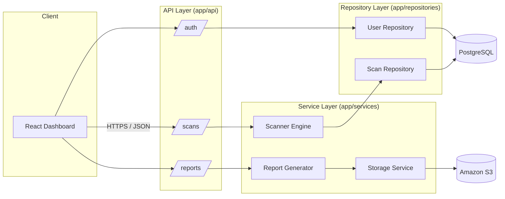

# Architecture

## Overview

POPIA Guard is a single backend service (FastAPI) with a React frontend,
PostgreSQL for persistence, and S3 for report storage. The backend follows a
three-layer split. This is intentionally not over-engineered: a solo-authored
scanner tool doesn't need eight architectural layers, but it does need a
clean boundary between "how a request comes in", "what the business logic
does", and "how data is persisted" so each can be tested and changed in
isolation.

## Layers

**API layer** (`app/api`) — FastAPI routers. Responsible only for request
validation (via Pydantic schemas), calling the appropriate service, and
shaping the HTTP response. No business logic lives here.

**Service layer** (`app/services`) — the actual behaviour of the system:

- `scanner/` — pattern-based detection engine (see
  [`SCANNER_DESIGN.md`](SCANNER_DESIGN.md))
- `storage/` — S3 client wrapper: uploads report artifacts, issues
  presigned URLs
- `report/` — turns a set of findings into a scored, structured report

**Repository layer** (`app/repositories`) — the only code that talks to
SQLAlchemy directly. Services depend on repository interfaces, not on the
ORM, which keeps persistence swappable and makes services testable with an
in-memory fake if needed.

**Core** (`app/core`) — cross-cutting concerns: settings (env-driven,
`pydantic-settings`), JWT/password handling.

## Why not more layers

The original planning pass for this project considered a full "enterprise"
layer split (presentation / business / repository / service /
infrastructure / auth / cloud / database as eight distinct packages). In
practice that split doesn't hold up for a project this size, several of
those layers would be one-file packages with a single class. Collapsing them
into API → Service → Repository keeps the separation that actually matters
(HTTP concerns vs. business logic vs. persistence) without empty ceremony.

## Data flow: a scan, end to end

1. Client uploads a file (or points to a GitHub repo) via `POST /scans`.
2. API layer validates the request and hands off to the scanner service.
3. Scanner service walks the source tree, runs the pattern registry against
   each text file, and produces `Finding` records.
4. Findings are persisted via the scan repository; a risk score and
   compliance percentage are computed by the report generator.
5. The report generator serialises the report, and the storage service
   uploads it to S3, storing only the object key in PostgreSQL (not a
   long-lived URL, since presigned URLs expire).
6. The dashboard requests a fresh presigned URL from `GET /reports/{id}`
   when the user wants to view or download it.

## Deployment shape

Local development runs via `docker/docker-compose.yml` (API + PostgreSQL).
Production deployment (Phase 4) targets a single EC2 instance running the
production Docker image behind Nginx, with S3 and RDS/PostgreSQL as managed
dependencies, deliberately simple rather than introducing an orchestrator
for a project of this size.
