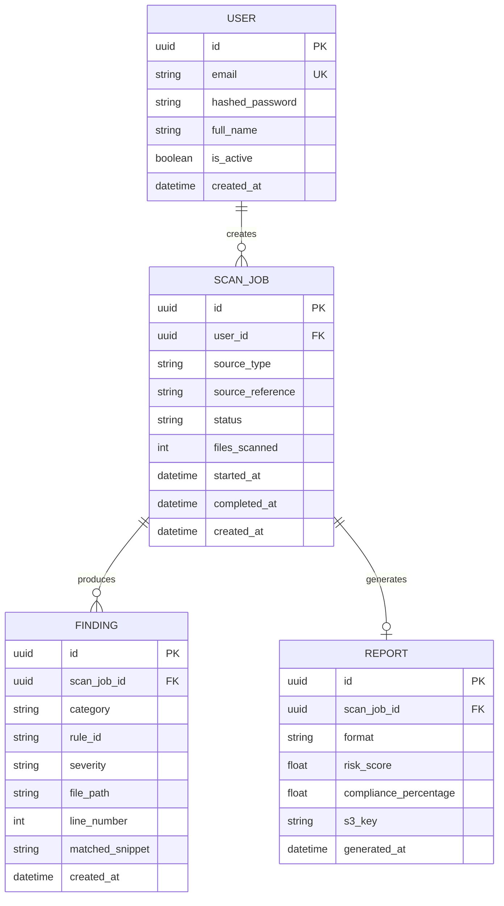

# Database Design

PostgreSQL, accessed through SQLAlchemy models in `app/models/`. Four
tables, deliberately: everything the scan → findings → report pipeline
needs, nothing speculative.

## Design notes

**`User`** is intentionally minimal — no role column. Role-based access
control was cut from this project's scope (see the main README); adding a
`role` column back in is a one-line migration if that changes.

**`ScanJob`** represents one scan run, whether the source was a ZIP upload
or a connected GitHub repo (`source_type` distinguishes the two,
`source_reference` holds the filename or repo URL). `status` is a plain
string enum (`pending`, `running`, `completed`, `failed`) rather than a
Postgres native enum, so adding a status later doesn't require a migration
that touches the type itself.

**`Finding`** stores one detection. `matched_snippet` is deliberately the
*redacted* match (e.g. an SA ID number with the middle digits masked), never
the raw sensitive value — a compliance tool that leaks the data it found
into its own database would defeat the point. `rule_id` maps back to the
pattern that fired (see `SCANNER_DESIGN.md`), which is what lets the report
generator group and score findings without re-running detection logic.

**`Report`** stores the *object key*, not a URL. Presigned S3 URLs expire,
so persisting one would go stale; the API generates a fresh presigned URL
on request instead. `risk_score` and `compliance_percentage` are computed
once at generation time and stored, rather than recomputed on every read.

## What's out of scope

No audit-log table, no notification table, no settings table — none of
those are needed for the core pipeline this project demonstrates, and
adding them now would be schema for features that don't exist yet.
